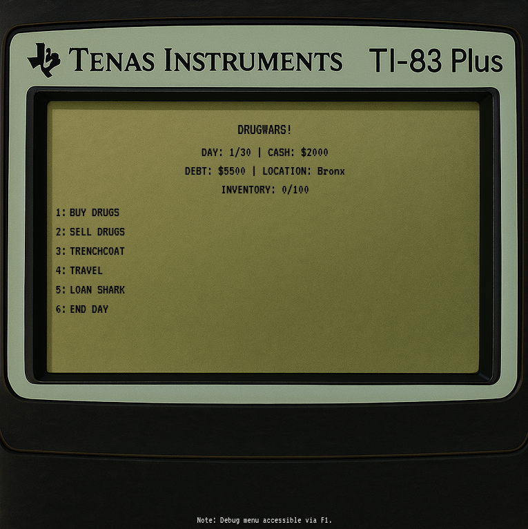

# DrugWars JS

  

A modern JavaScript remake of the classic calculator strategy game "Drug Wars" from the 1990s. Buy low, sell high, and try to make as much money as possible before your time runs out—all while avoiding the dangers of the streets.



## 🎮 Game Overview

In DrugWars JS, you play as a drug dealer in New York City. Your goal is to make as much money as possible by buying and selling drugs across different boroughs, managing your debt with loan sharks, and avoiding random events like police busts and muggings.

You start with a small amount of cash and a debt to the loan shark. You have 30 days to pay off your debt and make as much money as possible. Will you become the kingpin of NYC or end up broke and in debt?

## ✨ Features

- **Modern React Implementation**: Built with React 19, Vite, and Chakra UI
- **Two Game Interfaces**: 
  - Modern UI with Chakra components
  - Retro calculator-style UI for nostalgic gameplay
- **Strategic Gameplay**:
  - Buy and sell 6 different types of drugs across 6 NYC locations
  - Price fluctuations based on location and market conditions
  - Manage inventory space in your "trenchcoat"
  - Deal with loan sharks to borrow money or pay off debt
  - Use the bank to protect your money from theft
- **Random Events**: Face unexpected situations like police busts, price spikes, and muggings
- **State Management**: Uses Jotai for efficient state management with persistence
- **Debug Mode**: Press F1 to access debug features (for development and testing)

## 🚀 Installation

1. Clone the repository:
   ```bash
   git clone https://github.com/yourusername/drugwars-js.git
   cd drugwars-js
   ```

2. Install dependencies:
   ```bash
   npm install
   ```

3. Start the development server:
   ```bash
   npm run dev
   ```

4. Build for production:
   ```bash
   npm run build
   ```

## 🎲 How to Play

### Game Objective
Make as much money as possible within 30 days while paying off your initial debt. Your final score includes both your cash on hand and money in the bank.

### Basic Gameplay
1. **Buy Drugs**: Purchase drugs at low prices
2. **Travel**: Move between different NYC boroughs
3. **Sell Drugs**: Sell your drugs at higher prices
4. **Manage Debt**: Pay off your loan or borrow more money
5. **Use the Bank**: Deposit cash to protect it from theft during random events
6. **End Day**: Advance to the next day (prices will change)
7. **Watch Out**: Random events may occur that can help or hurt you

### Tips for Success
- Pay attention to price fluctuations across different locations
- Keep an eye on your inventory space
- Don't let your debt grow too large - the interest adds up!
- Sometimes it's worth traveling to find better prices
- Use the bank to protect your hard-earned cash from muggings and police busts

## 🧠 Game Mechanics

### Drugs
The game features six types of drugs, each with different price ranges and volatility:
- Weed: $300-$800 (Low volatility)
- Cocaine: $1,000-$3,000 (Medium volatility)
- Heroin: $5,000-$9,000 (High volatility)
- Acid: $1,000-$4,000 (Very high volatility)
- Speed: $250-$1,500 (Medium volatility)
- Ludes: $10-$60 (Low volatility)

### Locations
You can travel between six locations in NYC:
- Bronx
- Brooklyn
- Queens
- Manhattan
- Staten Island
- Central Park

Each location has different price patterns and risk levels.

### Random Events
During gameplay, you may encounter random events:
- Police Bust: Lose some drugs and cash (money in the bank is safe)
- Price Spike: Drug prices suddenly increase, sell everything you have!
- Price Plummet: Drug prices suddenly drop by 40-60%, great time to buy!
- Mugging: Lose some cash (money in the bank is safe)
- New Trenchcoat: Find a new trenchcoat that increases your inventory capacity by 100 units (can only happen once per game)

### Buying and Selling Drugs
You can buy drugs at the current market price and sell them later for a profit. Each drug has its own price range and volatility. Prices vary by location and day.

### Inventory Management
Your trenchcoat has limited space (initially 100 units). You can find a new trenchcoat that increases your capacity by 100 units.

### Loan Shark
You start the game with debt to a loan shark. You can borrow more money or repay your debt at any time. Interest accrues daily at 10%.

### Bank
The bank allows you to deposit your cash for safekeeping. Money in the bank is protected from police busts and muggings, adding a strategic element to your cash management. You can deposit and withdraw money at any time.

### Travel
You can travel between different locations in NYC. Each travel takes one day, and prices may change when you arrive at a new location.

## 🛠️ Technical Details

DrugWars JS is built with:
- React 19
- Vite
- Chakra UI
- Jotai (for state management)
- React Router

The game state is persisted in local storage, so your progress is saved even if you close the browser.

## 🤝 Contributing

Contributions are welcome! Feel free to open issues or submit pull requests.

1. Fork the repository
2. Create your feature branch: `git checkout -b feature/amazing-feature`
3. Commit your changes: `git commit -m 'Add some amazing feature'`
4. Push to the branch: `git push origin feature/amazing-feature`
5. Open a pull request

## 📜 License

This project is licensed under the MIT License - see the LICENSE file for details.

## 🙏 Acknowledgements

- Inspired by the original "Drug Wars" game by John E. Dell
- Built with React and modern web technologies
- Special thanks to all contributors and players

---

**Note**: This game is a work of fiction and is meant for entertainment purposes only. It does not promote or endorse illegal activities.
